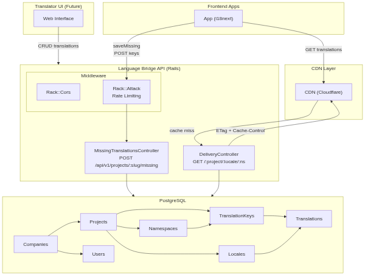
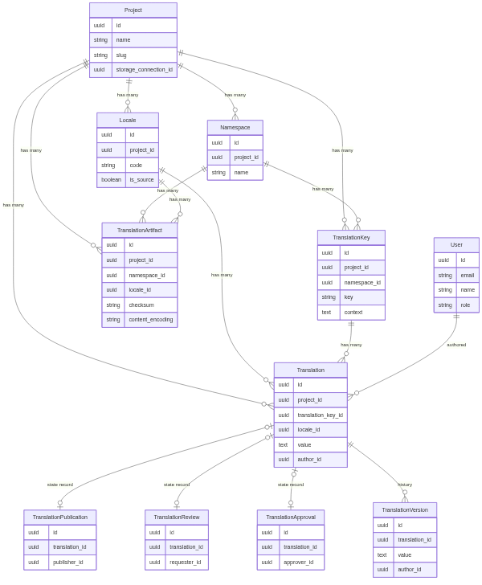

# Architecture

## System Overview



## Stack

- Ruby on Rails (API-only)
- PostgreSQL
- CDN-ready (ETag + Cache-Control headers)

## Data Model

```
Companies → Projects → Namespaces → TranslationKeys → Translations
                    → Locales ──────────────────────→ Translations
```



Source: [`architecture.mmd`](architecture.mmd)

## API

### Get translations (public, CDN-cached)

```
GET /:project_slug/:locale/:namespace
→ { "greeting": "Hello", "farewell": "Goodbye" }
```

### Report missing keys (from i18next saveMissing)

```
POST /api/v1/projects/:project_slug/missing
{ "locale": "en", "namespace": "common", "keys": { "new.key": "fallback value" } }
```

## Setup

```bash
bundle install
rails db:prepare
rails db:seed
rails server
```
